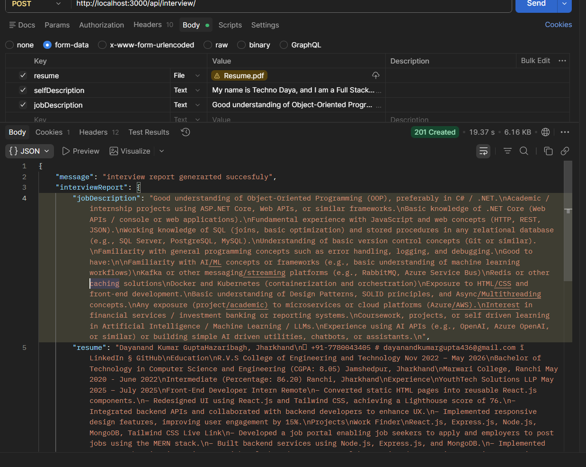

# 🤖 AI Interview Simulator

An intelligent web application that simulates real interview experiences by analyzing your resume against job descriptions. It identifies skill gaps, generates personalized interview questions, and provides a structured roadmap to improve your chances of getting hired.

---

## 🚀 Features

* 📄 **Resume Analysis**

  * Upload your resume (PDF/Text)
  * Extracts key skills, experience, and projects

* 🧠 **Job Description Matching**

  * Compare resume with job requirements
  * Calculate match score (%)

* 📊 **Skill Gap Detection**

  * Identifies missing or weak skills
  * Highlights areas for improvement

* 🎯 **AI Interview Questions**

  * Generates technical + behavioral questions
  * Based on role (Frontend, Backend, MERN, etc.)

* 🗺️ **Personalized Learning Roadmap**

  * Step-by-step plan to fill skill gaps
  * Includes resources and timelines

* 💬 **Mock Interview Simulation**

  * Chat-based AI interviewer
  * Real-time feedback

---


## 🛠️ Tech Stack

### Frontend

* React.js (Vite)
* SCSS / Tailwind CSS

### Backend

* Node.js
* Express.js

### Database

* MongoDB

### AI Integration

* OpenAI API / LLM
* NLP for resume parsing

---

## 📂 Project Structure

```
client/
 ├── src/
 │    ├── components/
 │    ├── pages/
 │    ├── features/
 │    │    ├── auth/
 │    │    ├── interview/
 │    │    └── resume/
server/
 ├── controllers/
 ├── routes/
 ├── models/
 ├── services/
```

---

## ⚙️ Installation

### 1️⃣ Clone the repo

```bash
git clone https://github.com/your-username/ai-interview-simulator.git
cd ai-interview-simulator
```

### 2️⃣ Install dependencies

#### Client

```bash
cd frontend
npm install
npm run dev
```

#### Server

```bash
cd backend
npm install
npm run dev
```

---

## 🔐 Environment Variables

Create `.env` file in server:

```
PORT=5000
MONGO_URI=your_mongodb_url
JWT_SECRET=your_secret
OPENAI_API_KEY=your_api_key
```

---

## 📸 Screenshots (Add later)

* Resume Upload Page
* Skill Gap Dashboard
* AI Interview Chat UI

---


## 🚀 Future Enhancements

* 🎙️ Voice-based interview (speech recognition)
* 📹 Video interview simulation
* 📊 Performance analytics dashboard
* 🧑‍💼 Company-specific interview preparation
* 🧠 AI feedback scoring system

---
## 📸 Screenshots

### 🔹 API Response (Interview Report)


> 📌 Shows successful API response after uploading resume + job description and generating AI-powered interview report.

---

## 🤝 Contributing

Pull requests are welcome! For major changes, open an issue first to discuss what you'd like to change.

---

## 📜 License

This project is licensed under the MIT License.

---

## 👨‍💻 Author

Your Name
GitHub: https://github.com/your-username

---

## ⭐ Support

If you like this project, give it a ⭐ on GitHub!
